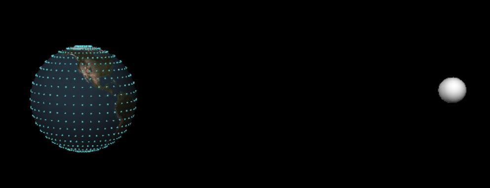

# Tidal Forces on Earth

## Description
This project simulated the effects of tidal gravity on the oceans. The purpose was to determine how long it will take until the earth will stop rotating, because of the force it feels by the moon pulling back on the rotation leading buldge of the oceans. The simulation computed that it will take 2.5 billion years, though scientific observation indicates it will take near 1.9 trillion years to reach equillibrium.
